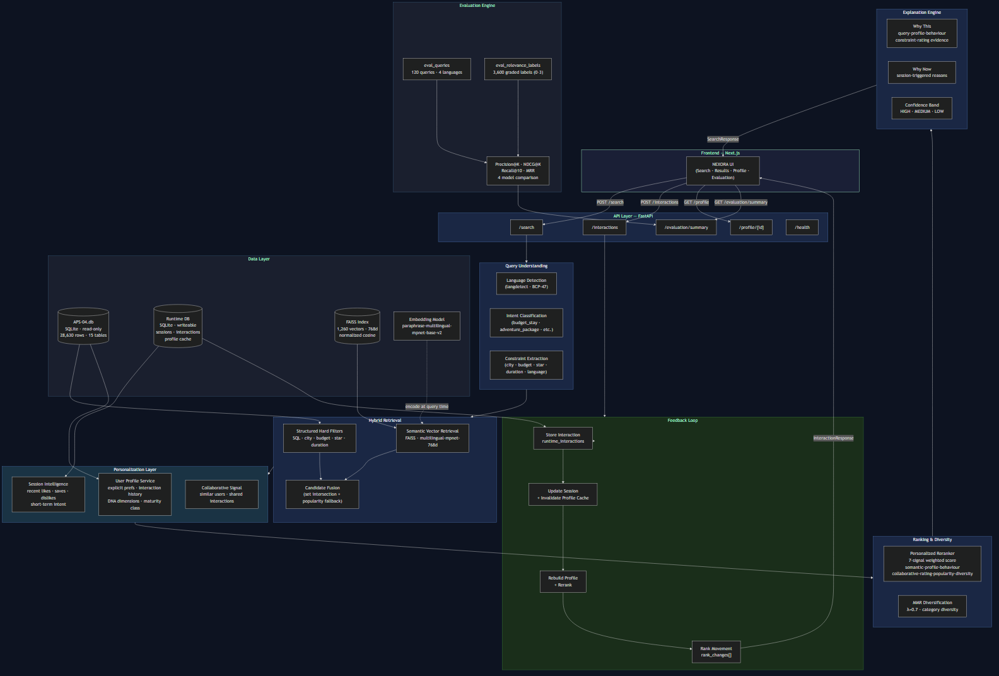

# 6. System Architecture

## 6.1 Overview

NEXORA is a two-tier application: a Next.js frontend and a Python/FastAPI backend. The backend is internally organised into functionally separated modules. There is no monolithic `main.py` — each layer is its own package.

**Architecture Diagram:**



*See also: `assets/diagrams/architecture.mmd` (Mermaid source)*

## 6.2 Architecture Layers

### Layer 1 — Frontend (Next.js)

The existing UI connects to the backend via a typed API client (`lib/api.ts`). The frontend does not contain any recommendation logic. It renders results, sends interaction signals, and receives updated rankings.

Key components:
- `app/page.tsx` — main view with Discover, Saved, Profile, Evaluation, System tabs
- `lib/api.ts` — typed TypeScript client matching all backend Pydantic schemas
- `.env.local` — `NEXT_PUBLIC_API_URL=http://localhost:8000`

### Layer 2 — API Layer (FastAPI)

Eight REST endpoints. Each is thin — validation, delegation to service layer, error handling. No business logic in the API layer.

| Endpoint | Purpose |
|----------|---------|
| `POST /search` | Main recommendation query |
| `POST /interactions` | Record like/save/dislike/click |
| `GET /profile/{user_id}` | Full user profile + DNA |
| `GET /session/{session_id}` | Session state |
| `GET /health` | System health check |
| `GET /evaluation/summary` | NEXORA metrics |
| `GET /evaluation/comparison` | 4-model comparison |
| `GET /recommendation/{id}/trace` | Score breakdown debug |

### Layer 3 — Query Understanding

Input: raw query string + optional filter object
Output: `QueryConstraints` + `QueryIntent` + semantic text

- Language detection: `langdetect`, returns BCP-47 tag
- Constraint extraction: deterministic keyword/regex + city name lookup
- Intent classification: pattern matching against `eval_intent` enum values
- Semantic text enrichment: appends detected constraints to query for better embedding

### Layer 4 — Hybrid Retrieval

**Structured filter (hard):**
SQL queries against read-only APS-04.db. Budget is enforced via join against `hotel_room_types`. Duration is a direct column check on `tour_packages`. Results outside constraints are excluded before any ML step.

**Semantic retrieval:**
The query is embedded using `paraphrase-multilingual-mpnet-base-v2`. A FAISS `IndexFlatIP` (inner product on normalized vectors = cosine similarity) searches 1,260 pre-computed item embeddings (300 hotels, 900 POIs, 60 packages).

**Candidate fusion:**
Intersection of semantic hits with the hard-filtered eligible set. If fewer than 5 semantic candidates survive, a popularity-ranked fallback fills the gap.

### Layer 5 — Personalization

**User Profile Service** (`app/personalization/user_profile.py`)

Reads from:
- `users` — base identity, travel_style, budget_band, traveller_type
- `user_preferences` — explicit preferences, languages, budget, interests, pace
- `user_interactions` (source + runtime) — signal history

Produces:
- `category_affinity` — per-category weighted signal score
- `liked/saved/disliked_entities` — explicit feedback lists
- `entity_type_affinity` — relative preference for hotel/poi/package
- `dna` — 8 dimensions (Adventure, Culture, Nature, etc.)
- `maturity_class` — cold_start / early / learning / mature

Cached in `user_profile_cache` (runtime DB). Invalidated on every interaction.

**Session Engine** (`app/session/session_engine.py`)

Maintains a per-session signal map. Signal weights are higher than long-term history weights. Session state persists in the runtime `sessions` table.

### Layer 6 — Ranking

**Personalized Ranker** (`app/ranking/personalized_ranker.py`)

```
final_score =
  w_sem × semantic_score
  + w_prof × profile_score
  + w_beh × behaviour_score
  + w_collab × collaborative_score
  + w_rating × rating_score
  + w_pop × popularity_score
  + 0.15 × session_score (always additive)
```

Default weights shift by profile maturity:

| Maturity | Semantic | Profile | Behaviour | Collaborative |
|----------|---------|---------|-----------|---------------|
| cold_start | 0.55 | 0.20 | 0.00 | 0.00 |
| early | 0.48 | 0.22 | 0.05 | 0.02 |
| learning | 0.40 | 0.25 | 0.12 | 0.04 |
| mature | 0.40 | 0.25 | 0.15 | 0.05 |

**MMR Diversification:**
After scoring, Maximal Marginal Relevance reranks by balancing relevance and category/entity-type diversity. λ=0.7 favours relevance; configurable.

### Layer 7 — Explanation Engine

Generates per-result structured reasons grounded only in actual signals. Never fabricates reasons. Confidence is computed from semantic score × profile maturity × query length.

### Layer 8 — Evaluation Engine

Runs all four models against `eval_queries` + `eval_relevance_labels` from APS-04. Computes Precision@K, NDCG@K, Recall@10, MRR. Results are exposed via the evaluation API.

### Layer 9 — Data Layer

| Store | Type | Role |
|-------|------|------|
| `APS-04.db` | SQLite, read-only | Source of truth — catalogue, users, interactions, eval |
| `nexora_runtime.db` | SQLite, writeable | Sessions, runtime interactions, profile cache, rank changes |
| FAISS index | Binary file | 1,260 × 768d float32 vectors, IndexFlatIP |
| Embedding model | Local (HuggingFace cache) | Inference at query time |

## 6.3 Dependency Map

```
page.tsx
  └── lib/api.ts
        └── FastAPI (port 8000)
              ├── /search
              │     ├── query_understanding.py
              │     ├── hybrid_retriever.py
              │     │     ├── structured_filter.py → APS-04.db
              │     │     └── engine.py (FAISS) → vector_index/
              │     ├── user_profile.py → APS-04.db + runtime.db
              │     ├── session_engine.py → runtime.db
              │     ├── personalized_ranker.py
              │     └── explanation_engine.py
              ├── /interactions
              │     └── interaction_service.py → runtime.db
              └── /evaluation
                    └── evaluator.py → APS-04.db + FAISS
```
